## "Parallelogram" Cloud App for Generating Parallel Fields in Alma

### Introduction

The "Parallelogram" Cloud App for Alma is used to generate parallel fields (either roman or non-roman text) in bibliographic records.  It does so by synthesizing results from WorldCat, Library of Congress authority records, and the Library of Congresss [ScriptShifter](https://bibframe.org/scriptshifter/) service.

This approach allows the tool to be used for a variety of different languages and scripts without needing detailed information about each language's rules for romanization, capitalization, punctuation, spacing, etc.  (Indeed, some languages do not have consistent "rules" that can easily be automated.) The tool has the ability to learn and communicate with the user about complex cases.  It presents multiple options for parallel text where there is ambiguity, and also allows the user to correct its suggestions.  Such corrections are saved in the tool's internal database and can be recalled the next time that text appears in a record.  Thus, over time, the tool should produce more consistent and accurate results.  That being said, it is always recommended to proofread the output in case adjustments are needed.

### Configuration

First of all, please note that depending on your Alma configuration, your administrator may need to enable Cloud Apps for you and allow access to the Parallelogram app.  As you follow the steps below, if you do not see the Cloud Apps menu or an option for Parallelogram in that menu, contact your administrator and request that they enable Alma Cloud Apps, as described in the following documentation from Ex Libris:

https://knowledge.exlibrisgroup.com/Alma/Product_Documentation/010Alma_Online_Help_(English)/050Administration/050Configuring_General_Alma_Functions/Configuring_Cloud_Apps

To incorporate WorldCat records in the output, a WorldCat Metadata API Key is needed.  This can be entered in the settings the first time the app is run.  A catalog administrator can also set the key for all users. (See the [App Settings](https://github.com/pulibrary/parallelogram/blob/v2-documentation/README.md#app-settings) section below for details.  It is also possible to securely deploy the key to users without making it visible to them.)  If you do not know your institution's WorldCat API Key, please contact your administrator. If your institution does not have an API Key, they may request one from OCLC (it is free for qualifying WorldCat members).  Further details can be found at the following website:

https://www.oclc.org/developer/api/oclc-apis/worldcat-metadata-api.en.html

However, even without a WorldCat Metadata API Key, the tool can still be used to query the ScriptShifter and LOC Linked data services. 

### Running the App

Before opening the app, you must first navigate to the bibliographic record you are interested in editing.  (Note: the app currently only works with Institution Zone records, i.e. those in your local catalog.)  The record can either be open in the MDE or in read-only mode (what you see if you click the title of the record in a results list).  Alternatively, if you launch the app with a list of search results open, it will select the first record in the list.  To launch the app, open the Cloud Apps Center using this icon in the upper right of the Alma window. 

|</img>|
|-|

(If you do not see it, you may need to click the three dots in the upper right of the window, which will show additional options).  Clicking the icon should open the following sidebar on the right side of the screen:

|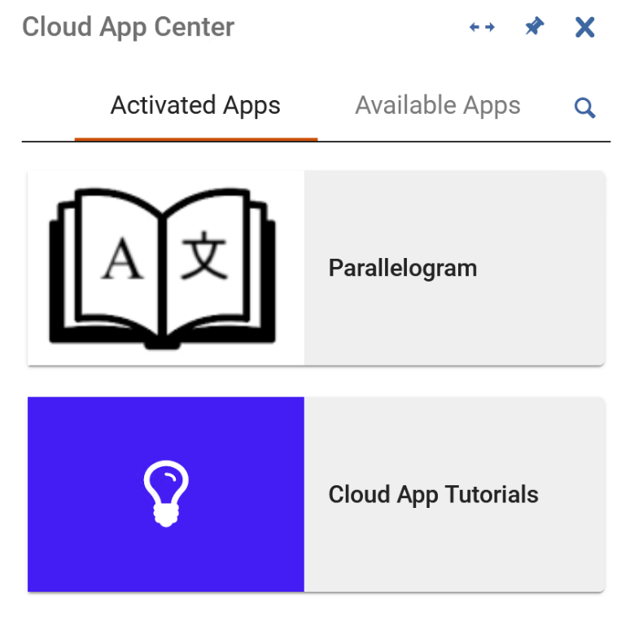</img>|
|-|

If you do not see "Parallelogram" under "Activated Apps", then go to the "Available Apps" tab and look for it.  (You may need to scroll down to the bottom of the list to see it.)  Select the app, then click "Activate".  It should then appear under "Activated Apps".   Clicking "Parallelogram" there should launch the app.  

The first time you run the app, it will go to the settings panel.  (You can simply click "Save", and then "Home" to confirm these settings.)  However, be sure to check "Search WorldCat" if you want to incorporate WorldCat into the app's output.  Other app settings are described in the [App Settings](https://github.com/pulibrary/parallelogram/blob/v2-documentation/README.md#app-settings) section further down in this README.)  In general, when the app first opens, you will see all of the data fields in the currently displayed record.  (Control fields are not included in order to simplify the display).

|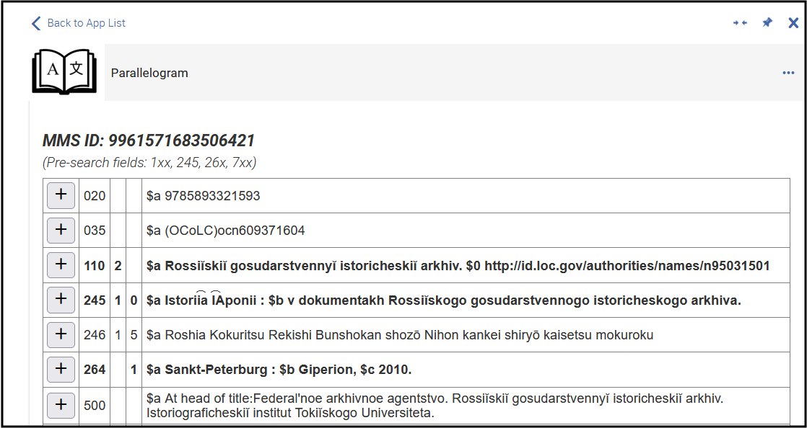</img>|
|-|

Depending on the app settings, you may need to wait for the app to perform some preliminary steps before you can edit the record.  These include "Searching WorldCat", "Analyzing Records", and "Pre-searching" specific fields.  The screen will go gray and the app will display the progress of these steps.  Once the progress spinner disappears and the screen brightens (as shown in the screenshot above), you can begin editing the record.  If pre-searching is enabled, any fields with successful pre-search results will be displayed in bold.  (See [App Settings](https://github.com/pulibrary/parallelogram/blob/v2-documentation/README.md#app-settings) below for an explanation of the pre-searching feature).  To generate a parallel field, click the plus sign icon to the left of the desired field.  The screenshot below shows the result of doing so for a few fields in this record.

|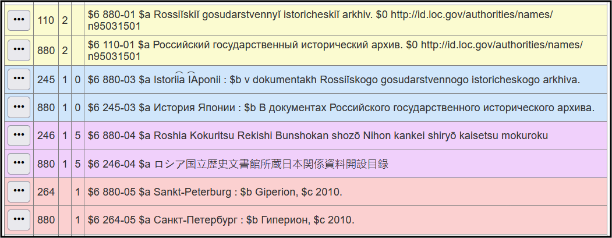</img>|
|-|

Parallel pairs are displayed next to each other and are highlighted in the same color.  In this particular case, the record contains some fields in Russian and one in Japanese, and uses the appropriate script in each case.  (See the detailed documentation below for different ways to refine the output if it is not totally accurate.)  After generating all of the desired parallel fields, click the "Save Record" button above the record to save your changes.  To close the app, you can click the X in the upper right of the window or "Back to App List" in the upper left.  Note that you may need to refresh your browser window or the MDE to see your changes reflected in Alma.  (In the MDE, selecting "Record Actions > Reload Original Record" will effectively refresh your display to show the record you just saved to the database via Parallelogram.  This is counter-intutive, since you are actually reloading a newer version of the record than the one previously shown in the MDE.  This is just a quirk of how Alma interacts with Cloud Apps). 

***BE SURE TO SAVE THE RECORD BEFORE YOU CLOSE THE APP!  IT WILL NOT WARN YOU IF YOU CLOSE IT WITH UNSAVED WORK!***

### Excluding text from conversion

Sometimes, you may only want to convert part of the field.  In the example above, field 500 contains some English text followed by romanized Russian.  To prevent the English part from being converted, simply highlight it before clicking the "+" button, as shown below.

|</img>|
|-|

In the generated parallel field, the English text is preserved.

|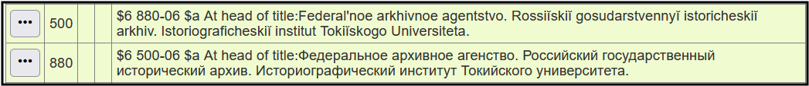</img>|
|-|

### Changing the default ScriptShifter language

Parallelogram draws its output from a few different sources.  It gives priority to data from WorldCat and LOC authority records.  (In the above example, this is how it is able to correctly generate Cyrillic text for the Russian fields, but Japanese text for field 246.)  However, when it cannot find sufficient data from these sources, it will use ScriptShifter to perform the conversion.  At the top of the window, to the right of the "Settings" button, there is a menu called "ScriptShifter language". 

|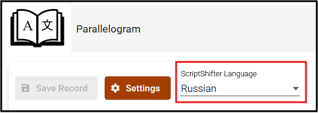</img>|
|-|

This menu indicates which language/script is used to perform the conversion, and is automatically set based on field 008 of the record (if auto-selection is enabled in the settings panel.)  You can select a different language to have Scriptshifer convert text using that language.  For example, consider the case of a Chinese work translated into Japanese.  Suppose that Parallelogram generates the Japanese romanization of the characters, as shown below:

|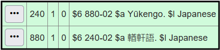</img>|
|-|

If you wanted it to use the Chinese romanization instead, you could delete the romanized field, set the "ScriptShifter" language to "Chinese", then click the "+" button again.  This would perform the romanization in Chinese.

|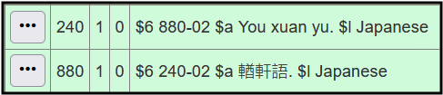</img>|
|-|

Note that this menu only affects ScriptShifter queries.  If WorldCat results are included, then the output may still include text that differs from the language/script selected in this menu.

### Field Options

Once a field has parallel data, the button to the left turns from a plus into an ellipsis.  Clicking it will open the menu below:

|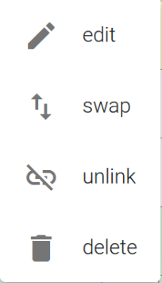</img>|
|-|

These menu options do the following:

* **edit**: Edit the field (see the next section for details).
* **swap**: Swap the contents of the parallel fields (except for subfield 6).  This button has the same effect whether you select it for the original field or the 880.
* **unlink**: Removes the link between the two fields without deleting them.  Subfield 6 will be removed from the original field, while in the 880, the occurrence number in subfield 6 will be changed to "00".  This button has the same effect whether you select it for the original field or the 880.
* **delete**:  Deletes the field.  If deleting an 880 field, subfield 6 is also deleted from the original field.  If deleting a non-880 field, the contents of the corresponding 880 are first copied over to the original field, replacing the original field's contents.  Then, subfield 6 of the original field is deleted as well as the entire 880 field.  In other words, when deleting a field, you are actually deleting the contents of the field.  In the end, it is always the 880 field that is removed.

### Editing Subfields

If you select the "edit" option for a given field, the field will expand so that you can edit the subfields, as shown in the screenshot below:

|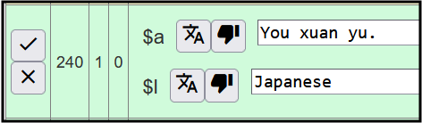</img>|
|-|

There is one line for each subfield (However, subfields $6 and $0 are not displayed and are not editable).  There are two buttons to the left of each subfield.  The "language" icon displays a list of candidates for that subfield. 

|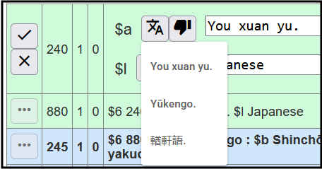</img>|
|-|

 In the example above, the app displays the two possible transliterations (Chinese and Japanese) of the CJK text, so both of these are displayed in the menu.  (Additionally, this menu will always include the original text from the parallel field.)  Selecting one of these candidates will populate the text box with that selection. 

Sometimes, the candidate list will include invalid options.  This may be due to ambiguity or errors in the data sources.  In such a case, the "thumbs down" button will remove the selected text from the candidate list as well as the app's internal database.  (It is still possible that the text could re-appear if a future search encounters the same data.  However, in many cases the thumbs down button is effective in keeping candidate lists from becoming too cluttered).

You can also edit the subfield text directly in the text box.  The app remembers your custom edits and will display them in the candidate list if the same parallel text is encountered in the future.  Clicking the "checkmark" button to the left of the field will save your changes to the subfields and also add any custom text to the app's internal database.    Clicking the "X" button will discard any changes you made to the candidate list or the subfield text.

### App Settings

The screenshots below show the app settings.  This screen can be accessed by clicking the "Settings" button above the record on the main screen. 

|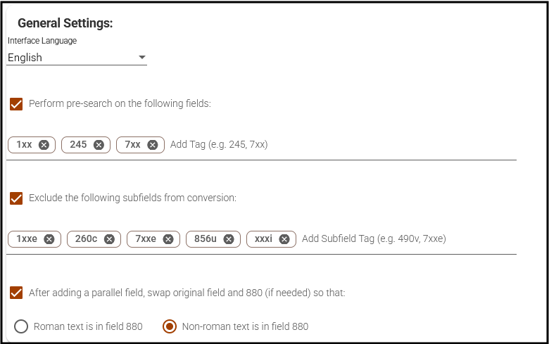</img>|
|-|

***General Settings***

* **Interface Language**: This sets language of the app interface itself (as opposed to the language of the records being edited).
* **Perform pre-search...**:  If checked, then the app will automatically search for parallel data for the specified fields.  If parallel data is found, the field is displayed in bold type.  Although this takes some extra time when the app is initially opened, it saves the trouble of having to click on a field to see if parallel data was found.  Fields can be removed from the pre-search list by clicking the X next to the tag name.  Additional fields can be added by typing the tag name to the right of the list.  (An 'x' may be used as a wildcard in tag names.)  The more tags in the list, the longer the pre-searching stage will take.  Also, if a tag is not in the pre-search list, it will not be displayed in bold even if that field has parallel data.  The app will not search for this data until you click the plus sign to the left of the field.
* **Exclude the following subfields...**: The subfields in this list will always be excluded from conversion, whether or not the user highlights the text.  As with the preserch list, 'x' can be used as a wildcard.
* **After adding a parallel field, swap original field and 880...**: If checked, this option allows you to set a policy for what kind of text is placed in the 880 field (either roman or non-roman text).  When a parallel field is added, the original and 880 fields are swapped (if needed) to conform to this policy.

|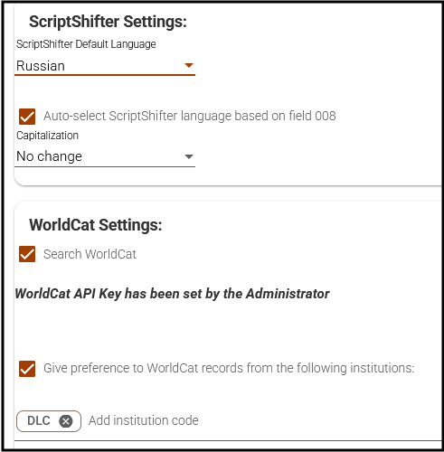</img>|
|-|

***ScriptShifter Settings***

* **ScriptShifter Default Language**: Specifies the language to use for ScriptShifter queries.  This may be overridden in specific cases by selecting another language from the ScriptShifter menu that appears on the main screen, or checking the "Auto-select..." option below it.  Once a language is selected, additional options specific to that language may appear in the settings panel.
* **Auto-select..."**: Checking this option will set the "ScriptShifter language" menu in the main window based on the language code of the 008 field of the record.  If the 008 field does not contain a code for a language supported by ScriptShifter, then the "ScriptShifter Default Language" specified above will be used.
* **Capitilization**: Indicates whether to capitalize the first word, all words, or none of the words in the ScriptShifter output.

***WorldCat Settings***

* **Search WorldCat**: Uncheck to derive results only from ScriptShifter and LOC authority records (or if you do not have access to a WorldCat Metadata API Key).
* **WorldCat Metadata API Key** and **Client Secret**: Needed in order to search for WorldCat records.  The Catalog Administrator may choose to populate these fields for all users and prevent them from being viewed or edited. (Such is the case in the above screenshot.)  However, if the administrator has not provided a key/secret pair, individual users may enter them.  The API Key and Client Secret not needed if you are only using the app to convert Chinese characters to pinyin.  
* **Give preference to WorldCat records...**: If checked, then the app will give greater weight to parallel text from records originating from specific institutions.  "DLC" (Library of Congress) is included by default, but you can enter any code that may be found in field 040.  This allows you to improve the quality of the parallel text by indicating that certain institutions can be trusted to produce good records.

* If the user has the "Catalog Administrator" role, two additional options will appear: 
    - **"Set WorldCat API Key for all users"**.  If checked, then when the settings are saved, the WorldCat API key will automatically be saved to all other users' settings.  This provides an easy and secure way to distribute the WCAPI key.
    - **"Hide WorldCat API Key from other users"**.  If checked, then other users will not be able to see or edit the API Key provided by the administrator.  (The app will still work for regular users, but the API Key will be a hidden setting).  However, if the admin has not provided a key, then other users will still be able to enter their own.
   
After configuring the app's options, click the "Save" button in the upper right.  This will save the settings as well as check the validity of the WorldCat API key.  Click the "Home" button to return to the app's main screen.

### Reporting Bugs and Making Suggestions

If you encounter any problems with this tool or would like to request new features, please go to the "Issues" tab at the top of this github page.

Also, if you would like to translate the app interface into a new language, please let me know by creating a new issue. There are about 40 short phrases used in the various buttons and alerts in the app, which I can provide in a spreadsheet.   We welcome such contributions and thank any contributers in advance!

### Acknowledgments

Many thanks to those who helped with beta testing the tool and translating the localization files: Ellen Ambrosone, Alim Alp, Shuwen Cao, Minjie Chen, Krikor Chobanian, Lia Contursi, Maria Gorbunova, Flora Kim, Hyoungbae Lee, Sumiko Maeda, Michael Meerson, Nannan Liu, Charles Riley, Joshua Seufert, Chiharu Watsky, and Mark Zelesky.  Special thanks to Stefano Cossu, Jessalyn Zoom, and the team at the Library of Congress that has made this collaboration possible.

### License

Parallelogram by Princeton University Library is licensed under a <a rel="license" href="http://creativecommons.org/licenses/by-sa/3.0/">Creative Commons Attribution-ShareAlike 3.0 Unported License</a>.

