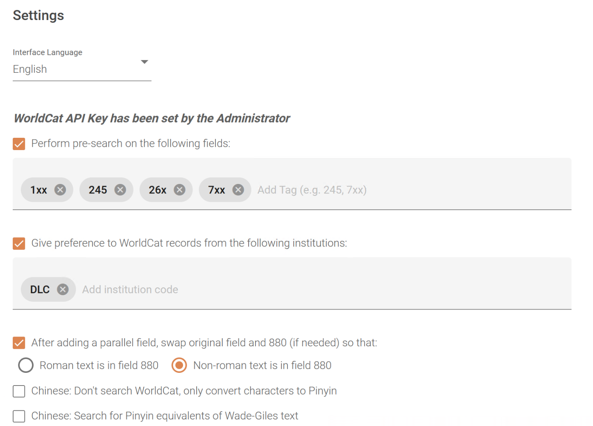

## "Parallelogram" Cloud App for Generating Parallel Fields

**NEW!** A beta version of Parallelogram 2.0 is now available!  This new version uses the Library of Congress [ScriptShifter](https://bibframe.org/scriptshifter/) tool in addition to WorldCat and authority records, greatly increasing the flexibility and accuracy of the tool.  If you are interested in trying the beta, see the section [Parallelogram 2.0 Beta](https://github.com/pulibrary/parallelogram/tree/main?tab=readme-ov-file#parallelogram-20-beta) at the end of this documentation.

**NOTE:** There is a known issue with running Parallelogram under the New Titles Search in Alma.  Details and workarounds can be found [here](https://github.com/pulibrary/parallelogram/issues/1).

### Introduction

The "Parallelogram" Cloud App for Alma is used to generate parallel fields in bibliographic records.  It can add a non-roman text field to romanized text and vice versa.  To do so, it uses identifiers in the target record (ISBNs, OCLC numbers, etc.) to search for similar records in WorldCat and the Library of Congress Linked Data Service (id.loc.gov).  It examines the parallel fields in these records and uses its findings to generate parallel text in the target record (provided it can find such text).

The above approach allows the tool to be used for a variety of different languages and scripts without needing detailed information about each language's rules for romanization, capitalization, punctuation, spacing, etc.  (Indeed, some languages do not have consistent "rules" that can easily be automated.)  Though language-independent, it also has some features specific to Chinese, and can be used as a "pinyin converter", similar to the other tools that Princeton University Library has created for [MarcEdit](https://library.princeton.edu/eastasian/addpinyin-plugin-marcedit) and [OCLC Connexion Client](https://library.princeton.edu/eastasian/oclcpinyin).

Because the app is dependent on WorldCat and LOC data, it may not always find the information it needs.  There is a chance that it will not be able to generate parallel text in every case, and the text it does generate is not guaranteed to be accurate.  The tool compensates for this by presenting multiple options for parallel text where there is ambiguity, and also allowing you to correct its suggestions.  Such corrections are saved in the tool's internal database and can be recalled the next time that text appears in a record.  Thus, over time, the tool should produce more consistent and accurate results. 

### Configuration

First of all, please note that depending on your Alma configuration, your administrator may need to enable Cloud Apps for you and allow access to the Parallelogram app.  As you follow the steps below, if you do not see the Cloud Apps menu or an option for Parallelogram in that menu, contact your administrator and request that they enable Alma Cloud Apps, as described in the following documentation from Ex Libris:

https://knowledge.exlibrisgroup.com/Alma/Product_Documentation/010Alma_Online_Help_(English)/050Administration/050Configuring_General_Alma_Functions/Configuring_Cloud_Apps

If you are using the app for anything other than converting Chinese characters to pinyin, then you will need a WorldCat Metadata API Key.  This can be entered in the settings the first time the app is run.  A catalog administrator can also set the key for all users.  If you do not know your institution's WorldCat API Key, please contact your administrator. If your institution does not have an API Key, they may request one from OCLC (it is free for qualifying WorldCat members).  Further details can be found at the following website:

https://www.oclc.org/developer/api/oclc-apis/worldcat-metadata-api.en.html

### Chinese Pinyin Mode

As noted above, the app has a special mode for converting Chinese characters to romanization (pinyin).  If this mode is enabled, then the app will us its internal dictionary to do the conversion, rather than searching WorldCat.  Thus, the app can be run without a WorldCat API Key, and overall it will run more quickly and produce more accurate results.  To enable this mode, go to the app settings, check **"Chinese: Don't Search WorldCat, only convert characters to pinyin"**.  Then, save the settings and click the "Home" button.  Note that you will need to uncheck this setting if you want to use the app for other languages or to convert Chinese romanization to characters.

### Launching the App

Before opening the app, you must first navigate to the bibliographic record you are interested in editing.  (Note: the app currently only works with Institution Zone records, i.e. those in your local catalog.)  The record can either be open in the MDE or in read-only mode (what you see if you click the title of the record in a results list).  Alternatively, if you launch the app with a list of search results open, it will select the first record in the list.  To launch the app, open the Cloud Apps Center using this icon in the upper right of the Alma window. 

|</img>|
|-|

(If you do not see it, you may need to click the three dots in the upper right of the window, which will show additional options).  Clicking the icon should open the following sidebar on the right side of the screen:

|</img>|
|-|

If you do not see "Parallelogram" under "Activated Apps", then go to the "Available Apps" tab and look for it.  (You may need to scroll down to the bottom of the list to see it.)  Select the app, then click "Activate".  It should then appear under "Activated Apps".   Clicking "Parallelogram" there should launch the app.  When the app first opens, you will see all of the data fields in the currently displayed record.  (Control fields are not included in order to simplify the display).

|</img>|
|-|

Depending on the app settings, you may need to wait for the app to perform some preliminary steps before you can edit the record.  These include "Searching WorldCat", "Analyzing Records", and "Pre-searching" specific fields.  The screen will go gray and the app will display the progress of these steps.  Once the progress spinner disappears and the screen brightens (as shown in the screenshot above), you can begin editing the record.  If pre-searching is enabled, any fields with successful pre-search results will be displayed in bold.  (See "App Settings" below for an explanation of the pre-searching feature).  To generate a parallel field, click the plus sign icon to the left of the desired field.  The screenshot below shows the result of doing so for fields 245 and 260.

|</img>|
|-|

Parallel pairs are displayed next to each other and are highlighted in the same color.  In this case, the app settings indicate that non-roman text should always be put in field 880, so the Japanese text originally in field 245 has been moved to the corresponding 880 field.  However, since field 260 originally contained romanized text, the app simply adds a subfield 6 with a linkage value and generates an 880 with the Japanese text.  (See "App Settings" below for more information about this setting).

After adding all of the desired parallel fields, click the "Save Record" button above the record to save your changes.  To close the app, you can click the X in the upper right of the window or "Back to App List" in the upper left.  Note that you may need to refresh your browser window or the MDE to see your changes reflected in Alma.

***BE SURE TO SAVE THE RECORD BEFORE YOU CLOSE THE APP!  IT WILL NOT WARN YOU IF YOU CLOSE IT WITH UNSAVED WORK!***

### Field Options

Once a field has parallel data, the button to the left turns from a plus into an ellipsis.  Clicking it will open the menu below:

|</img>|
|-|

These menu options do the following:

* **edit**: Edit the field (see the section "Editing Subfields" below).
* **swap**: Swap the contents of the parallel fields (except for subfield 6).  This button has the same effect whether you select it for the original field or the 880.
* **unlink**: Removes the link between the two fields without deleting them.  Subfield 6 will be removed from the original field, while in the 880, the occurrence number in subfield 6 will be changed to "00".  This button has the same effect whether you select it for the original field or the 880.
* **delete**:  Deletes the field.  If deleting an 880 field, subfield 6 is also deleted from the original field.  If deleting a non-880 field, the contents of the corresponding 880 are first copied over to the original field, replacing the original field's contents.  Then, subfield 6 of the original field is deleted as well as the entire 880 field.  In other words, when deleting a field, you are actually deleting the contents of the field.  In the end, it is always the 880 field that is removed.

### Editing Subfields

If you select the "edit" option for a given field, the field will expand so that you can edit the subfields, as shown in the screenshot below:

|</img>|
|-|

There is one line for each subfield (However, subfields $6 and $0 are not displayed and are not editable).  There are two buttons to the left of each subfield.  The "language" icon displays a list of candidates for that subfield.  In the example above, the app found two CJK transliterations of "Tokyo", so both of these are displayed in the menu.  (Additionally, this menu will always include the original text from the parallel field.)  Selecting one of these candidates will populate the text box with that selection. 

Sometimes, the candidate list will include invalid options.  This may be due to ambiguity or errors in the WorldCat or authority records that are found.  In such a case, the "thumbs down" button will remove the selected text from the candidate list as well as the app's internal database.  (It is still possible that the text could re-appear if a future search encounters the same data.  However, in many cases the thumbs down button is effective in keeping candidate lists from becoming too cluttered).

You can also edit the subfield text directly in the text box.  The app remembers your custom edits and will display them in the candidate list if the same parallel text is encountered in the future.  Clicking the "checkmark" button to the left of the field will save your changes to the subfields and also add any custom text to the app's internal database.    Clicking the "X" button will discard any changes you made to the candidate list or the subfield text.

### App Settings

The screenshot below shows the app settings.  This screen can be accessed by clicking the "Settings" button above the record on the main screen. 

|</img>|
|-|

The settings are:

* **Interface Language**: This sets language of the app interface itself (as opposed to the language of the records being edited).  
* **WorldCat Metadata API Key** and **Client Secret**: Needed in order to search for WorldCat records.  The Catalog Administrator may choose to populate these fields for all users and prevent them from being viewed or edited. (Such is the case in the above screenshot.)  However, if the administrator has not provided a key/secret pair, individual users may enter them.  The API Key and Client Secret not needed if you are only using the app to convert Chinese characters to pinyin.  
* **Perform pre-search...**:  If checked, then the app will automatically search for parallel data for the specified fields.  If parallel data is found, the field is displayed in bold type.  Although this takes some extra time when the app is initially opened, it saves the trouble of having to click on a field to see if parallel data was found.  Fields can be removed from the pre-search list by clicking the X next to the tag name.  Additional fields can be added by typing the tag name to the right of the list.  (An 'x' may be used as a wildcard in tag names.)  The more tags in the list, the longer the pre-searching stage will take.  Also, if a tag is not in the pre-search list, it will not be displayed in bold even if that field has parallel data.  The app will not search for this data until you click the plus sign to the left of the field.
* **Give preference to WorldCat records...**: If checked, then the app will give greater weight to parallel text from records originating from specific institutions.  "DLC" (Library of Congress) is included by default, but you can enter any code that may be found in field 040.  This allows you to improve the quality of the parallel text by indicating that certain institutions can be trusted to produce good records.
* **After adding a parallel field, swap original field and 880...**: If checked, this option allows you to set a policy for what kind of text is placed in the 880 field (either roman or non-roman text).  When a parallel field is added, the original and 880 fields are swapped (if needed) to conform to this policy.
* There are two options specific to Chinese:
    - If you are only interested in converting Chinese characters to pinyin (and not vice versa), you can check the **"Don't search WorldCat..."** option.  This will bypass WorldCat searching and generate parallel fields using the app's built-in dictionary.  This is faster and more accurate than using WorldCat.  If this option is checked, the app can be run without a WorldCat API key.
    - If you are processing records that contain Wade-Giles romanization, you can check the **"Search for Pinyin equivalents..."** option, which will convert Wade-Giles text to pinyin and search for both versions of the text.  This makes the app run slightly slower but increases the chances of finding relevant data in WorldCat.
* If the user has the "Catalog Administrator" role, two additional options will appear: 
    - **"Set WorldCat API Key for all users"**.  If checked, then when the settings are saved, the WorldCat API key will automatically be saved to all other users' settings.  This provides an easy and secure way to distribute the WCAPI key.
    - **"Hide WorldCat API Key from other users"**.  If checked, then other users will not be able to see or edit the API Key provided by the administrator.  (The app will still work for regular users, but the API Key will be a hidden setting).  However, if the admin has not provided a key, then other users will still be able to enter their own.
   
After configuring the app's options, click the "Save" button in the upper right.  This will save the settings as well as check the validity of the WorldCat API key.  Click the "Home" button to return to the app's main screen.

### Reporting Bugs and Making Suggestions

If you encounter any problems with this tool or would like to request new features, please go to the "Issues" tab at the top of this github page.

Also, if you would like to translate the app interface into a new language, please let me know by creating a new issue. There are about 40 short phrases used in the various buttons and alerts in the app, which I can provide in a spreadsheet.   We welcome such contributions and thank any contributers in advance!

### Acknowledgments

Many thanks to those who helped with beta testing the tool and translating the localization files: Ellen Ambrosone, Shuwen Cao, Minjie Chen, Krikor Chobanian, Lia Contursi, Maria Gorbunova, Flora Kim, Hyoungbae Lee, Sumiko Maeda, Nannan Liu, Joshua Seufert, Chiharu Watsky, and Mark Zelesky.  

### License

Parallelogram by Princeton University Library is licensed under a <a rel="license" href="http://creativecommons.org/licenses/by-sa/3.0/">Creative Commons Attribution-ShareAlike 3.0 Unported License</a>.

### Parallelogram 2.0 Beta

The next major release of Parallelogram will make use of [ScriptShifter](https://bibframe.org/scriptshifter/), a transliteration tool created by the Library of Congress.  This tool provides ALA-compliant transliterations in a variety of languages.  Combining ScriptShifter with the data sources already used by Parallelogram will produce an even more powerful and flexible tool.

If you are interested in beta-testing this new version, open the Cloud App center, and click the blue "i" symbol in the upper right of the Parallelogram menu item.  This will show more details about the app.  Under "More Information", click "Try v2.0.x-beta" (The last digit of the version number may change as new beta versions are released).

|</img>|
|-|

After activating the beta version, the interface will look slightly different.  When opening a record in Parallelogram, a small menu will appear at the top that says "ScriptShifter Language".  

|</img>|
|-|

The tool will attempt to auto-detect the language based on field 008 of the record.  However, you can also select a different language, or set the language to "None" if you do not want to incorportate ScriptShifter results.  Note that some languages/scripts have more than one entry in this menu.  For example, Korean has separate entries for general use and personal names.  And Uighur has separate entries for Cyrillic and Arabic script.

The tool still functions in basically the same way as before.  However, if ScriptShifter produces results different than those found by searching WorldCat or authority records, these will be included in the candidate list for a subfield.  (In general, results found from WorldCat or authority records will still be given preference.)

When first using the beta version, be sure to visit the settings screen again to make sure the settings are set properly for you. This screen as been reorganized somewhat, with a section for ScriptShifter settings.  This includes the option to auto-detect the language of the record from field 008, and the ability to set a default language.  ScriptShifter options specific to a certain language will also be displayed when that language is selected. (These options are not available on the main record display screen.)  Options specific to the Chinese language have been removed, since ScriptShifter is now being used for Chinese script-to-roman transliteration.  Also, WorldCat searching can be disabled if one wants to use ScriptShifter exclusively (or does not have the needed subscription to WorldCat).

Some script conversions supported by ScriptShifter are based on tools developed by the Princeton University East Asian Library, and so the results will be similar to those produced by these tools:
- Korean romanization is based on [K-Romanizer](https://github.com/pulibrary/K-Romanizer), developed by Hyoungbae Lee.
- Chinese romanization is based on the [OCLC Connexion Pinyin Conversion Macro](https://github.com/pulibrary/oclcpinyin), developed by Tom Ventimiglia.

Please feel free to use the discusson forum to share any feedback about this new version.  Special thanks to Stefano Cossu, Jessalyn Zoom, and the team at the Library of Congress that has made this collaboration possible.
